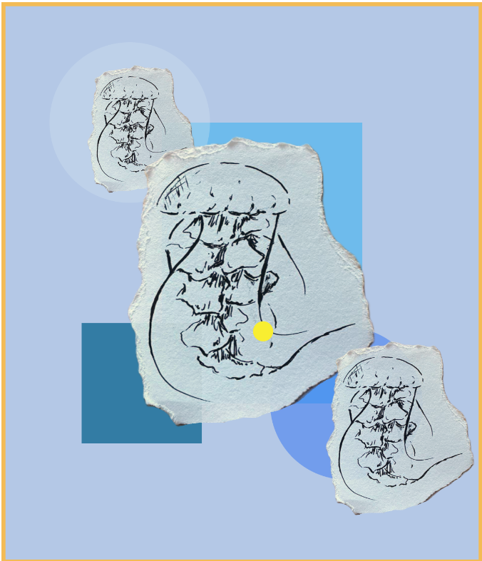

<h2> <strong> Reflective Journal</strong> </h2>

<h4> 13 sept 2026 </h4>

 During this assignment, I learned a lot of things like creating different types of Markdown elements such as paragraphs, headings, and images. Markdown helped me remember how to do different things and I also got used to working with VS Code and GitHub and understanding how they function together. I learned how to resize an image and make it fit properly on my website. What I enjoyed most was experimenting and figuring things out by myself, especially learning how to include an image and add a link to my own work. Even though it was hard at first to understand the code that must be written for it to appear correctly on my website, eventually I got the hang of it. During the first days, understanding VS Code and how to write some code like the image one took me a lot of time. I added an image of my own work from my last semester at Cégep.  I hope in the future, people who visit my website will not just get to enjoy my projects but also get to know who I am through them. I want them to see my evolution and improvement in each project I create, while still recognizing my identity and artistic voice.

Here is a screenshot of my website: 

 

<h4> 21 sept 2026 </h4>

 This week, I created three small prototypes using p5.js, and each one taught me something different about drawing with code. At first, it was hard to understand how to start and where to start, but once I began experimenting with basic shapes and colors, everything became easier to manipulate. 

The first prototype, City light, helped me manipulate different functions and get used to drawing and layering with simple instructions. It showed me how ahpes can build a scene and how changing fill or stroke affects the mood of the drawing. The two other prototypes were about experimenting with new codes that I found in p5.js reference website like the colorMode and the erase. These taught me how to play with transparency, brightness and depth in a drawing. I didn't expect these tools to change the look of the artwork so much, and made me more curious about what else is possible to do with p5.js.Something that I found difficult was adding the links to my projects, especially connecting the online drawings or the code paths on my website. I had to switch to HTML because the Markdown syntax didn't want to work.But now I think I understand how both formats behave. 

Overall, I learned a lot from this prototype.I'm really intrested in developing animation next, like making shapes move or react. I hope someone looking at my work sees how each piece explores a diffrent idea. Here is an example of the animation, that I would like to do taken from p5.js refrence website: 

<h4> 28 sept 2026 </h4>

 These prototypes were the most challenging project I've made so far, mainly because of the animation part. I had many ideas at first, but some were too complex to code, so I chose to go with simpler drawings in order to focus on exploring the animation part of this week properly and not overwhelm myself.

Even thought I struggled at the beginning, each prototype taught me something new. I learned how movement can interact with a drawing, like in my second prototype "The Shower" where bubbles and water appear depending on the mouse movement and create a diffrent feeling each time. Controlling how fast drops fall, whether in the shower or the melting ice cream prototypes, was difficult at first, but once I understood the logic behind timing, it became much easier to control and adjust. I also realised how important it is to place code correctly inside the draw loop and how one missing bracket or coma can break the whole animation and stop everything from working. 

Overall, these prototypes helped me get more comfortable using variables, timing and interaction to create motion in my drawings, and they gave me more confidence to try new ideas in the future prototypes. 

<h4> 9 oct 2026 </h4>

 Across all three prototypes, I learned how conditionals can be created adding a movement effect to the drawing. Each drawing reacts diffrently depending on the viwer interaction, for example the jellyfish appears when the mouse is on it like a memory, the fish changes behavior as it travels home. I was surprised to see how an image can be animated but also could be modifided, made transparent, bigger or smaller using simple code.

In each prototype, the hardest part was adding the photo and figuring out where the errors were comming from, either the preload or from forgetting imageMode (CENTRE). Once I understood the structure and where my mistakes usally are, everything became easier. I was sruprised to know how conditionals can change the behavior of the image, expressing a personality and making a stroy or interactive image.

Overall, these prototypes helped me understand how a code can express an emotion and a narative, not just a movement such as the last drawing "Fish going home". 

