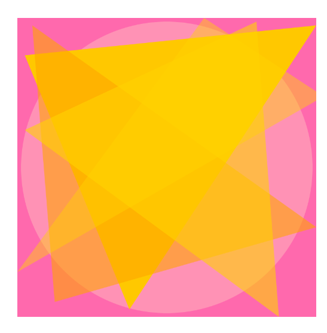

<h5>CART 253</h5>

<h1> <strong> My projects </strong> </h1>

<h3> Razan Elsaygh </h3>

 
 

The purpose of this website is to show all my coursework for CART 253, including my prototypes and reflections. It's a sapce where I will share my projects and reflect on how i grow and improve during the semester.

 

Here is a link to my <a href="Journal.md">Journal</a>.

<h4>Drawing Prototypes </h4>

 Here is my new projects (22 sept)

<h5> Prototype 1: City Lights </h5>

<a href="https://razanelsayegh-sys.github.io/cart253/Prototype%201%20city%20lights/">View this project online</a>

<a href="https://razanelsayegh-sys.github.io/cart253/Prototype 1 city lights/js/script.js">View the script of this project</a>

<h5> Prototype 2: Abstract Art </h5>

<a href="https://razanelsayegh-sys.github.io/cart253/Prototype%202%20abstract/">View this project online</a>

<a href="https://razanelsayegh-sys.github.io/cart253/Prototype 2 abstract/js/script.js">View the script of this project</a>

<h5> Prototype 3: Weird Creature </h5>

<a href="https://razanelsayegh-sys.github.io/cart253/Prototype%203%20weird%20creature/">View this project online</a>

<a href="https://razanelsayegh-sys.github.io/cart253/Prototype 3 weird creature/js/script.js">View the script of this project</a>
